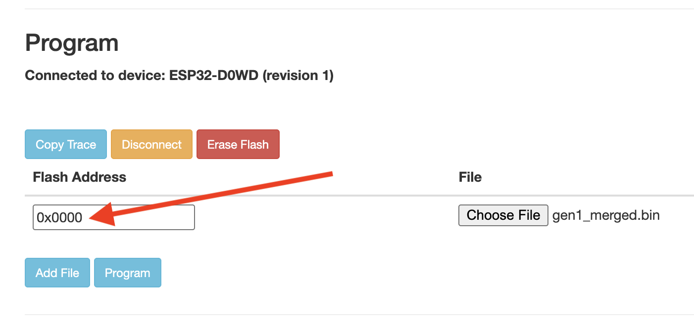

# Tronbyt Firmware

[]([https://discord.gg/r45MXG4kZc](https://discord.gg/nKDErHGmU7))

This repository contains a community supported firmware for the Tidbyt hardware 🤓.

## Warning

⚠️ Warning! Flashing your Tidbyt with this firmware or derivatives could fatally
damage your device. As such, flashing your Tidbyt with this firmware or
derivatives voids your warranty and comes without support.

## Getting Started

Follow the setup instructions for [tronbyt-server][3] unless you want to build yourself with platformio.

## Building yourself with PlatformIO

Only follow these instructions if you want to build the firmware yourself. Otherwise let the [tronbyt-server][3] generate the firmware file for you.
This project uses PlatformIO to build, flash, and monitor firmware on the Tidbyt.
To get started, you will need to download [PlatformIO Core][2] on your computer.

Additionally, this firmware is designed to work with https://github.com/tronbyt/server or
you can point this firmware at any URL that hosts a WebP image that is optimized for the Tidbyt display.

To flash the custom firmware on your device, run the following after replacing
the variables in secrets.json.example with your desired own information and renaming it to `secrets.json`
If using tronbyt_manager in docker replace the ip address to the docker host's ip address.

```
{
    "WIFI_SSID": "myssiD",
    "WIFI_PASSWORD": "<PASSWORD>",
    "REMOTE_URL=": "http://homeServer.local:8000/admin/tronbyt_1/next",
    "REFRESH_INTERVAL_SECONDS": 10,
    "DEFAULT_BRIGHTNESS" : 30
}
```

Then run the following command:

```
pio run --environment tidbyt-gen1 --target erase --target upload
```

If you're flashing to a Tidbyt Gen2, just change to the above to use
the `--environment tidbyt-gen2` flag.

## Monitoring Logs

To check the output of your running firmware, run the following:

```
pio device monitor
```

## 8Hz Displays

There have been minor issues with certain displays showing red artifacts and slightly off color-pallettes. This seems most likely related to manufacturing tolerances.

In these cases you can use the following environments to try the display at 8Hz instead of 10Hz for the coresponding environments:

- `tidbyt-gen1-patched`
- `tidbyt-gen1_swap-patched`
- `tidbyt-gen2-patched`

This [patches](extra_scripts/patch_i2s_divider.py) the HUB75 matrix library to use the legacy clock division calculation that the [OS Tidbyt library](https://github.com/tidbyt/ESP32-HUB75-MatrixPanel-I2S-DMA/blob/8f284afe7ba4ff369a4427121338e1673026320e/esp32_i2s_parallel_dma.c#L163) uses before build.

## Back to Normal

### Using Web Flasher (Recommended)

The easiest way to restore your Tidbyt to factory firmware is using the web flasher with the pre-built merged binary files:

1. Download the appropriate merged binary file:
   - **Gen 1**: [gen1_merged.bin](https://github.com/tronbyt/firmware-esp32/raw/main/reset/gen1_merged.bin)
   - **Gen 2**: [gen2_merged.bin](https://github.com/tronbyt/firmware-esp32/raw/main/reset/gen2_merged.bin)
2. Visit [https://espressif.github.io/esptool-js/](https://espressif.github.io/esptool-js/) (requires Chrome or Edge browser)
3. Connect your Tidbyt via USB
4. Use the following settings:
   - **Flash Address**: `0x0`
   - **File**: Select the downloaded merged binary file



4. Click "Program" to flash the factory firmware

### Using PlatformIO

Alternatively, you can use PlatformIO to restore the factory firmware.

To get your Tidbyt back to normal, you can run the following to flash the
production firmware onto your Tidbyt:

```
pio run --target reset --environment tidbyt-gen1
```

And if you're working with a Tidbyt Gen 2:

```
pio run --target reset --environment tidbyt-gen2
```
### Using the WiFi config portal
The firmware has a rudimentary wifi config portal page that can be accessed by joining the TRONBYT-CONFIG network and navigating to http://10.10.0.1  . 
[WiFi Config Portal How-To Video](https://www.youtube.com/watch?v=OAWUCG-HRDs)

[1]: https://github.com/tidbyt/pixlet
[2]: https://docs.platformio.org/en/latest/core/installation/index.html
[3]: https://github.com/tronbyt/server
